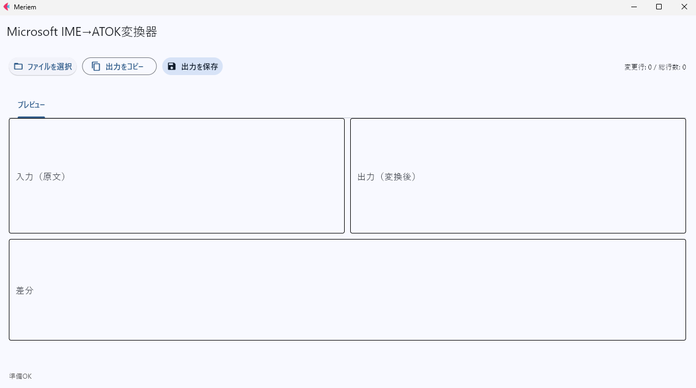

# プロジェクト概要
Fletを用いたシンプルな辞書変換アプリ 

# 主な機能
・特定のフォーマットに含まれる、記述に対してMicrosoft IMEからATOK用の記述に変化を行う  
・変換の対象は促音（っ）のみ

# アプリの仕様
・ファイルはドラッグ＆ドロップに対応しています。  
・出力の保存  
・出力のコピー  
・出力先は入力ファイルと同じパスです。  
・出力はtxtでtsv形式、ANSIコードで出力されます。  
・変更差分の表示  
・出力のタイトルは、{入力のファイル名}_ATOK.txtです。  
・ファイルを選択した時点で変換されます。  

# GUIのイメージと使い方
※固有名詞が記載されるため、起動時のみ

＜使い方＞
1. アプリを起動
2. ファイルを選択
3. 差分と出力の確認
4. 出力の保存もしくはコピー

※特手のフォーマットに依存しているのでエラーが出る可能性があります。

# 動作環境
・Windows 10/11
・Python 3.11 以降推奨
・依存：pandas / openpyxl / PyYAML / tkinterdnd2

# 使い方
1 本レポジトリをクローン
    git clone https://github.com/F1orie/Microsoft-IME-to-ATOK.git

2 仮想環境作成（任意）
    python -m venv venv
    venv\\Scripts\\activate

3 ライブラリのインポート
    pip install -r requirements.txt

4 アプリの起動
    python ATOK_app.py

# 作者
作成者: F1orie
GitHub: @F1orie