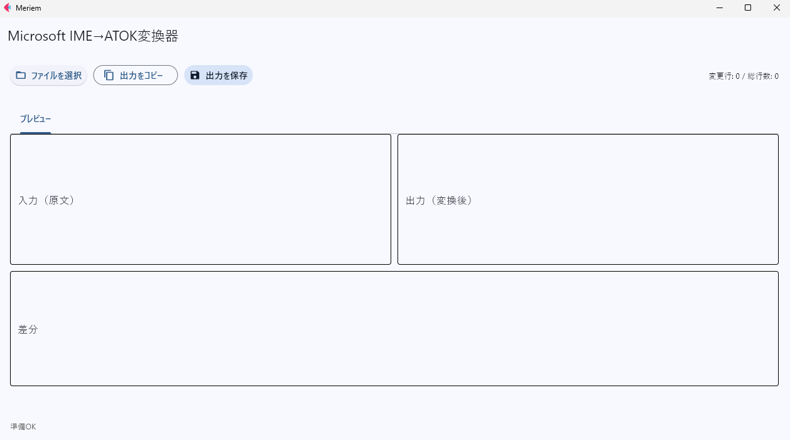

# プロジェクト概要
Fletを用いたシンプルな辞書変換アプリ 

# 主な機能
・特定のフォーマットに含まれる、記述に対してMicrosoft IMEからATOK用の記述に変化を行う  
・変換の対象は子音が２連続以上のもの。対象を促音（っ）に変換
・出力の保存  
・出力のコピー  

# アプリの仕様
・想定される入力ファイルは、txtファイル、タブ形式でANSIコードで記述されているものです。  
・出力先は選択したパスです。  
・出力はtxtでtsv形式、ANSIコードで出力されます。  
・変更差分の表示（品詞列だけが変わった行は差分・変更行数に含めない）  
・出力保存時の既定ファイル名は `【ATOK】{入力のファイル名}.txt`（省入力モードのときは `【ATOK】{入力のファイル名}(省入力).txt`）。  
・モード切替：辞書（品詞あり）／省入力（品詞列のみ空欄、語句列は保持）  
・ファイルを選択した時点で変換されます。  
・「a,i,u,e,o,n」は変換の対象外です。

# 追加仕様
・読み（A列）が32カウント以上になる場合は、32カウント目の文字を半角の「@」に置き換え、それ以降の文字を削除します。  
・読み（A列）の文字数カウントでは、濁点・半濁点付きの文字を2カウントとして扱います。（例：「か」は1カウント、「が」は2カウント）  
・読み（A列）に「ヴ」または「ゔ」が含まれる場合は、ANSIコードで保存できるように「う゛」の表記へ変換します。  
・B列（語句）やD列（コメント）に含まれる機種依存文字は、ANSI/cp932で保存できる文字であればそのまま出力します。（例：「Ⅰ」「Ⅳ」「髙」「﨑」など）  
・ANSI/cp932で保存できない文字が出力に含まれる場合は、差分欄に対象の行・列・文字を表示します。そのうえで、対象文字を含む行を除外し、保存可能な行だけを保存します。  
・保存できない文字を含む行を除外した結果、保存可能な行が残らない場合は保存を中止します。

# GUIのイメージと使い方
※固有名詞が記載されるため、起動時のみ

＜使い方＞
1. アプリを起動
2. ファイルを選択
3. 差分と出力の確認
4. 出力の保存もしくはコピー

※特手のフォーマットに依存しているのでエラーが出る可能性があります。

# 動作環境
・Windows 10/11
・Python 3.11 以降推奨
・依存：pandas / openpyxl / PyYAML / tkinterdnd2

# 使い方
1 本レポジトリをクローン
    git clone https://github.com/F1orie/Microsoft-IME-to-ATOK.git

2 仮想環境作成（任意）
    python -m venv venv
    venv\\Scripts\\activate

3 ライブラリのインポート
    pip install -r requirements.txt

4 アプリの起動
    python ATOK_app.py

# 作者
作成者: F1orie
GitHub: @F1orie